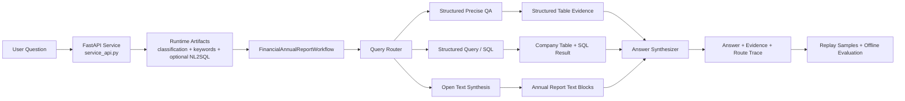

# AnnualReportAgent-demo

Public demo repository for a multi-route financial annual report QA agent. This version is trimmed for GitHub review: it keeps the workflow, API surface, benchmark summaries, replayable public samples, and a small public data subset, while leaving out the private full PDF corpus, training checkpoints, and bulk experiment artifacts.

[中文说明](./README.zh-CN.md)

## Overview

This project answers Chinese financial annual report questions with different execution routes instead of a single generic RAG chain.

- Structured field lookup: find exact values such as accounts payable, revenue, or legal representative.
- SQL / ranking analysis: translate ranking and aggregation questions into executable queries over a normalized company table.
- Open report synthesis: retrieve relevant report text blocks and generate grounded summaries or evidence-based refusals.
- Evaluation loop: keep benchmark summary cards, replay representative cases, and retain a small public regression set.

The original private workspace used a larger 2019-2021 A-share annual report corpus. The public demo keeps a 14-record structured subset, one report text slice, four public sample cards, and summary benchmark evidence to make the repository runnable and interview-friendly without exposing the full experiment archive.

## Problem

Financial annual report QA is not one problem.

- Some questions need direct table lookup.
- Some require comparison or simple reasoning across years.
- Some are better handled as SQL over normalized structured data.
- Some are open-ended and need evidence retrieval from long report text.

Treating all of them as one retrieval prompt often creates avoidable errors, weak provenance, or slow responses. This demo shows a route-aware agent design instead.

## Workflow / Architecture



## Key Components

- `service_api.py`
  FastAPI entry point with `GET /health`, `POST /v1/query`, and `POST /v1/query/stream`.

- `financial_agent_workflow.py`
  Core routed workflow with `QueryRouter`, `DocumentEvidenceRetriever`, `StructuredQueryExecutor`, and `AnswerSynthesizer`.

- `api_llm.py`
  OpenAI-compatible LLM adapter used for classification, keyword extraction, SQL generation, and answer synthesis.

- `company_table.py`
  Structured finance table loader and SQL execution utilities for ranking / aggregation questions.

- `recall_report_text.py` and `recall_report_names.py`
  Evidence retrieval for open-ended questions and table-level matching.

- `evaluation/`
  Offline scripts that regenerate public benchmark summary files from bundled sample cards and metric snapshots.

- `scripts/replay_demo.py`
  No-key demo replay entry for interview walkthroughs.

## Repository Layout

```text
.
├── .env.example
├── service_api.py
├── financial_agent_workflow.py
├── api_llm.py
├── company_table.py
├── data/
│   ├── CompanyTable.csv
│   ├── basic_info.json
│   ├── cbs_info.json
│   ├── cscf_info.json
│   ├── cis_info.json
│   ├── dev_info.json
│   ├── employee_info.json
│   ├── evaluation/
│   ├── public_bundle_manifest.json
│   ├── pdf_docs/
│   └── raw_pdfs/
├── benchmarks/
├── docs/
│   └── samples/
├── evaluation/
├── scripts/
└── tests/
```

## Public Bundle

The repo intentionally ships only a small, interview-friendly public subset:

- `data/public_bundle_manifest.json`
  Machine-readable inventory of what is intentionally included in the public demo.

- `14` `pdf_info` records
  Enough report metadata to support the 4 replay samples and the SQL ranking route.

- `14` `CompanyTable.csv` rows
  A minimal normalized table slice that still makes the ranking example meaningful.

- `14` keyed entries in each structured table JSON
  Enough structured facts to support the live structured-route examples without carrying the full 1000-report archive.

- `1` report text slice under `data/pdf_docs/`
  The Qingdao Port 2019 text fragment used by the open-question refusal demo.

## How to Run

### 1. Install

```bash
python -m venv .venv
source .venv/bin/activate
pip install -r requirements.txt
```

Optional PDF preprocessing dependencies:

```bash
pip install -r requirements-preprocess.txt
```

### 2. Replay a public sample without any API key

```bash
python scripts/replay_demo.py --list
python scripts/replay_demo.py --sample structured_field_qa
python scripts/replay_demo.py --sample open_report_boundary
```

### 3. Start the API server

```bash
uvicorn service_api:app --reload
```

Health check:

```bash
curl http://127.0.0.1:8000/health
```

### 4. Run a live query with an OpenAI-compatible endpoint

Create `.env` from `.env.example`, or point to a custom file:

```bash
cp .env.example .env
export ANNUAL_REPORT_AGENT_ENV_FILE=/absolute/path/to/.env
```

Example request:

```bash
curl -X POST http://127.0.0.1:8000/v1/query \
  -H "Content-Type: application/json" \
  -d '{
    "question_id": 1,
    "question": "请告诉我龙岩卓越新能源股份有限公司2021年的应付账款的具体数值"
  }'
```

## Demo / Example

Representative replay:

```bash
$ python scripts/replay_demo.py --sample sql_ranking_qa
Sample: SQL ranking over normalized annual-report tables
Question ID: 2
Question: 2019年负债总额第2高的上市公司是？
Route: E / structured_query / SQL / 统计分析
Execution Path: Query Router -> Structured Query -> Synthesis

Answer:
公司全称为中远海运控股股份有限公司。

Evidence:
1. [sql] select 公司全称 from company_table where 年份 = '2019' order by 负债合计 desc limit 1 offset 1
2. [sql_result] 中远海运控股股份有限公司

Validation:
- Regression case: passed
- Stored latency: 3746.2 ms
```

Public sample files:

- `docs/samples/structured_field_qa.json`
- `docs/samples/sql_ranking_qa.json`
- `docs/samples/open_report_boundary.json`
- `docs/samples/cross_year_compare.json`

## Evaluation / Benchmark

The repository includes public evaluation summaries under `data/evaluation/` and a summarized public card under `benchmarks/benchmark_card.json`.

Important boundary:
The metric rows below are summary evidence from the original private evaluation scope. They are kept as public benchmark cards; the full 1000-case artifact archive is not shipped in this repo.

| Metric | Result | Scope |
| --- | ---: | --- |
| Classification exact accuracy | `0.944` | 1000 stored questions |
| Route-bucket accuracy | `0.998` | 1000 stored questions |
| SQL generation success | `1.000` | 200 SQL-route questions |
| SQL execution success | `1.000` | 200 SQL-route questions |
| Structured answer accuracy | `0.6656` | 700 structured / calculation questions |
| Open answer accuracy | `0.2612` | 300 open questions |
| Regression pass rate | `4 / 4` | Public demo regression set |
| Average latency | `2964.09 ms` | 4 representative public benchmark questions |

Additional public evidence kept in-repo:

- `data/evaluation/open_badcase_sample_summary.json`
  Small open-question summary with `19 / 20` answered cases and average similarity `0.2029`.

- `evaluation/run_regression.py`
  Rebuilds a lightweight regression report from the 4 bundled public sample cards.

- `evaluation/pipeline_metrics.py`
  Rewrites the public metric snapshot from the bundled benchmark summary card.

## Limitations

- This public repo does not ship the full raw annual report corpus or model checkpoints from the private workspace.
- This public repo ships a deliberately small structured data subset, so live runs are meant for demo questions rather than full-corpus coverage.
- This public repo also does not ship the original 1000-case classify / keyword / SQL / workflow artifact archive; only summary metrics and 4 sample cards are kept.
- Live inference depends on an external OpenAI-compatible LLM endpoint; the replay demo is offline, but `POST /v1/query` is not.
- Open-ended report questions remain the weakest area, which is visible in the open-answer metric.
- The preprocessing pipeline still expects local PDF tooling such as `xpdf`, `camelot`, and `ghostscript`.
- The code is kept close to the original project structure to preserve provenance, so it is intentionally less framework-polished than a greenfield package.
