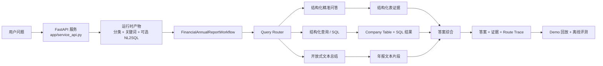

# AnnualReportAgent-demo

这是一个面向 GitHub 展示整理过的金融年报智能分析 Agent demo 仓库。公开版保留了最能证明项目真实工作量的部分：多路由工作流、API 入口、benchmark 摘要、可回放样例，以及一小份可公开的数据子集；不再附带私有全量 PDF 语料、训练检查点和大批实验归档文件。

[English README](./README.md)

## 快速理解

- 这是什么：
  一个面向中文上市公司年报问答的多路由 Agent，同时覆盖结构化字段检索、SQL 统计分析和基于证据的开放式总结。

- 为什么不是普通 RAG：
  不同问题类型走不同执行路径，而不是把所有问题都塞进一条统一检索链路。

- 这个公开 demo 到底保留了什么：
  一个 14 条记录的结构化子集、4 个可回放样例卡片、1 份开放题文本切片，以及 benchmark 摘要证据。

- 最快怎么验证它不是空壳：
  直接运行 `python scripts/replay_demo.py --sample sql_ranking_qa`，不需要 API key。

## Quickstart

```bash
python -m venv .venv
source .venv/bin/activate
pip install -r requirements.txt
python scripts/replay_demo.py --sample sql_ranking_qa
```

如果你只是想验证公开 demo，到这里就够了。
如果你想接上真实模型接口继续跑 live inference，再往下看 `How to Run`。

## Overview

这个项目不是把所有金融问答都塞进一条通用 RAG 链路，而是按问题类型走不同执行路径：

- 结构化字段问答：直接定位“应付账款、法定代表人、收入”等字段值。
- SQL / 排名统计：把排名、筛选、聚合类问题转成可执行 SQL。
- 开放式年报问答：召回年报文本片段，再做总结或基于证据拒答。
- 评测闭环：保留 benchmark 摘要卡片、回放脚本和最小公开回归集，便于展示系统不是空壳。

原始私有项目基于更大的 2019-2021 年 A 股年报语料。公开 demo 只保留一个 14 条记录的结构化子集、一个小型报告切片、4 个公开样例卡片和汇总指标，方便面试官快速理解系统价值，同时避免把整套实验归档全部公开。

## Problem

金融年报问答本质上不是单一任务：

- 有些题是精确字段查找。
- 有些题要跨年份比较。
- 有些题天然更适合 SQL 排名或聚合。
- 有些题是开放性说明题，需要从长文本中找证据再归纳。

如果把它们全部当成一种检索问答问题来处理，往往会牺牲可解释性、准确率和速度。这个 demo 展示的是一个“按路由分工”的 Agent 设计。

## Workflow / Architecture



## Key Components

- `app/service_api.py`
  FastAPI 入口，提供 `GET /health`、`POST /v1/query`、`POST /v1/query/stream`。

- `app/financial_agent_workflow.py`
  核心工作流，包含 `QueryRouter`、`DocumentEvidenceRetriever`、`StructuredQueryExecutor`、`AnswerSynthesizer`。

- `app/api_llm.py`
  OpenAI 兼容接口的 LLM 适配层，用于分类、关键词提取、SQL 生成和答案综合。

- `app/company_table.py`
  结构化总表加载和 SQL 执行工具，负责排名 / 聚合类问题。

- `app/recall_report_text.py` 与 `app/recall_report_names.py`
  文本证据召回和表格级匹配逻辑。

- `evaluation/`
  离线评测脚本，用公开样例卡片和摘要指标重新生成公开版回归报告与 benchmark 摘要。

- `scripts/replay_demo.py`
  无需密钥的公开 demo 回放入口。

## 建议先看

如果你想快速理解这个仓库，可以先看这些入口：

- `README.md`
  看项目定位、公开边界、运行方式和 benchmark 口径。

- `app/service_api.py`
  看公开 API 入口和 live query 的调用面。

- `app/financial_agent_workflow.py`
  看核心多路由工作流和带证据的答案生成逻辑。

- `docs/samples/sql_ranking_qa.json`
  看一个最能说明“为什么要单独做 SQL 路由”的紧凑样例。

- `benchmarks/benchmark_card.json`
  看整理后的公开 benchmark 摘要卡片。

## Repository Layout

```text
.
├── .env.example
├── app/
│   ├── service_api.py
│   ├── financial_agent_workflow.py
│   ├── api_llm.py
│   ├── company_table.py
│   └── ...
├── data/
│   ├── CompanyTable.csv
│   ├── basic_info.json
│   ├── cbs_info.json
│   ├── cscf_info.json
│   ├── cis_info.json
│   ├── dev_info.json
│   ├── employee_info.json
│   ├── evaluation/
│   ├── public_bundle_manifest.json
│   ├── pdf_docs/
│   └── raw_pdfs/
├── benchmarks/
├── docs/
│   └── samples/
├── evaluation/
├── legacy/
│   ├── preprocess.py
│   ├── main.py
│   └── ...
├── scripts/
└── tests/
```

## Public Bundle

公开仓刻意只保留一份很小、适合面试展示的数据子集：

- `data/public_bundle_manifest.json`
  机器可读的公开清单，列出 demo 里到底保留了哪些内容。

- `14` 条 `pdf_info` 元数据
  足够支撑 4 个公开样例和 SQL 排名路由。

- `14` 行 `CompanyTable.csv`
  一个最小可解释的结构化总表切片，仍然能支持“2019 年负债总额第 2 高”的排名问题。

- 每个结构化表 JSON 各 `14` 个 key
  只保留公开演示题所需的结构化事实，不再附带 1000 份年报汇总资产。

- `data/pdf_docs/` 下 `1` 份年报文本切片
  用于开放题拒答示例的青岛港 2019 年文本片段。

- `legacy/`
  保留原项目里较旧的预处理和实验脚本，用于证明项目演化过程，但默认 quickstart 不依赖它们。

## How to Run

### 1. 安装依赖

```bash
python -m venv .venv
source .venv/bin/activate
pip install -r requirements.txt
```

如果需要跑 PDF 预处理链路，再安装可选依赖：

```bash
pip install -r requirements-preprocess.txt
```

### 2. 无密钥回放公开样例

```bash
python scripts/replay_demo.py --list
python scripts/replay_demo.py --sample structured_field_qa
python scripts/replay_demo.py --sample open_report_boundary
```

### 3. 启动 API 服务

```bash
uvicorn app.service_api:app --reload
```

健康检查：

```bash
curl http://127.0.0.1:8000/health
```

### 4. 配置模型后跑真实问答

先把 `.env.example` 复制成 `.env`，或者显式指定：

```bash
cp .env.example .env
export ANNUAL_REPORT_AGENT_ENV_FILE=/absolute/path/to/.env
```

请求示例：

```bash
curl -X POST http://127.0.0.1:8000/v1/query \
  -H "Content-Type: application/json" \
  -d '{
    "question_id": 1,
    "question": "请告诉我龙岩卓越新能源股份有限公司2021年的应付账款的具体数值"
  }'
```

## Demo / Example

一个代表性的公开回放：

```bash
$ python scripts/replay_demo.py --sample sql_ranking_qa
Sample: SQL ranking over normalized annual-report tables
Question ID: 2
Question: 2019年负债总额第2高的上市公司是？
Route: E / structured_query / SQL / 统计分析
Execution Path: Query Router -> Structured Query -> Synthesis

Answer:
公司全称为中远海运控股股份有限公司。

Evidence:
1. [sql] select 公司全称 from company_table where 年份 = '2019' order by 负债合计 desc limit 1 offset 1
2. [sql_result] 中远海运控股股份有限公司

Validation:
- Regression case: passed
- Stored latency: 3746.2 ms
```

公开样例文件放在：

- `docs/samples/structured_field_qa.json`
- `docs/samples/sql_ranking_qa.json`
- `docs/samples/open_report_boundary.json`
- `docs/samples/cross_year_compare.json`

## Evaluation / Benchmark

仓库中保留了公开版评测摘要 `data/evaluation/`，并额外整理了一张 benchmark 卡片 `benchmarks/benchmark_card.json`。

边界说明：
下面这些指标是从私有完整评测范围中抽取出来的公开摘要证据，并不是说这个仓库内仍然附带完整 1000 题中间产物。

| 指标 | 结果 | 口径 |
| --- | ---: | --- |
| 分类准确率 | `0.944` | 1000 条已存储问题 |
| 路由桶准确率 | `0.998` | 1000 条已存储问题 |
| SQL 生成成功率 | `1.000` | 200 条 SQL 路由问题 |
| SQL 执行成功率 | `1.000` | 200 条 SQL 路由问题 |
| 结构化答案准确率 | `0.6656` | 700 条结构化 / 计算题 |
| 开放题答案准确率 | `0.2612` | 300 条开放题 |
| 回归通过率 | `4 / 4` | 公开 demo 回归集 |
| 平均延迟 | `2964.09 ms` | 4 条代表性公开样例 |

仓库里还保留了几份轻量证据：

- `data/evaluation/open_badcase_sample_summary.json`
  20 条开放题小样本摘要，其中 `19 / 20` 生成了非空答案，平均相似度 `0.2029`。

- `evaluation/run_regression.py`
  基于 4 个公开样例卡片重新生成轻量回归报告。

- `evaluation/pipeline_metrics.py`
  基于公开 benchmark 卡片重新写出汇总指标快照。

## Limitations

- 公开仓没有附带私有工作区中的全量原始年报 PDF 和训练检查点。
- 公开仓只保留了刻意缩小的数据子集，因此 live run 更适合作为 demo 展示，而不是完整语料覆盖测试。
- 公开仓也没有附带原始 1000 题 classify / keyword / SQL / workflow 中间产物，只保留摘要指标和 4 个样例卡片。
- 实时问答依赖外部 OpenAI 兼容模型接口；离线回放不需要密钥，但 `POST /v1/query` 需要。
- 开放式年报问答仍然是最弱的一块，这一点在公开指标里也能直接看到。
- PDF 预处理链路仍依赖本地 `xpdf`、`camelot`、`ghostscript` 等工具。
- 代码结构保留了较多原项目痕迹，目的是展示真实工程演化过程，而不是把它包装成一个过度重构的空壳仓库。
